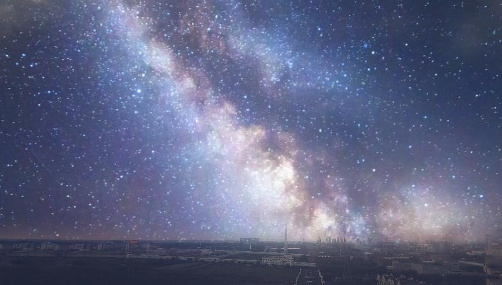

# SkyTransfer

## Introduction
An AI tool based on SkyAR(https://github.com/jiupinjia/SkyAR.git). SkyTransfer only have the function of transfering the images.
The result image is the image you get after transfering the sky of the style image to the content image.

## Requirements
In the file called Requirements.txt, you can find all the packages you need to install before running the code.
```
pip install -r Requirements.txt
```

## Usage
First, you need to download the pretrained model from the link below:
`https://drive.google.com/file/d/1COMROzwR4R_7mym6DL9LXhHQlJmJaV0J/view?usp=sharing`
<br></br>
Then, you need to unzip the file and put the `checkpoints_G_coord_resnet50` folder in the same folder with the `start.py` file.
```
python start.py --path ./config/config-my_photo-galaxy.json
```
Then you can get an image int the `./output` folder.
In order to difference the output images, the name of the output image folder in `./output` ends with the time you run the code.
<br></br>
You can also use the `--path` to specify the config file you want to use.
Here is the example of the `config` file:
``` json
{
    "net_G": "coord_resnet50",
    "ckptdir": "./checkpoints_G_coord_resnet50",

    "datadir": "./imageinput",
    "skybox": "seaSunSet.jpg",
  
    "in_size_w": 384,
    "in_size_h": 384,
    "out_size_w": 845,
    "out_size_h": 480,
  
    "skybox_center_crop": 0.5,
    "auto_light_matching": true,
    "relighting_factor": 0.8,
    "recoloring_factor": 0.5,
    "halo_effect": true,
  
    "output_dir": "./output",
    "save_jpgs": true
  }
``` 
`WARNING`: The `skybox` is the style image you want to transfer to the content image. You have better not change the name of it.

### New Mode ( in the branch `beta`)
Now you can change the app mode to `Server` mode.
In this mode, you can send http request to the server and get the result image.
``` shell
python start.py --on-server True
```
Then you can find the server is running on the port 9889.
```
INFO:     Started server process [xxxxx]
INFO:     Waiting for application startup.
INFO:     Application startup complete.
INFO:     Uvicorn running on http://127.0.0.1:9889 (Press CTRL+C to quit)
```
You can send the request to the server using the url below:
```
http://localhost:9889/api/sky-transfer
```
The request method is `POST`.
Use `form-data` to send the request.
The key of the image you want to transfer is `file`.
The other key is `maskId`, which is the id of the mask you want to use in the `skybox` dir.
<br></br>


## Result
Input image:

Output image:

If the color of the input image is too dark, the result image will be too dark to see the details.

## Reference
``` bibtex
@inproceedings{zou2020skyar,
    title={Castle in the Sky: Dynamic Sky Replacement and Harmonization in Videos},
    author={Zhengxia Zou},
    year={2020},
    journal={arXiv preprint arXiv:2010.11800},
}
```
Last but not least, thanks for the author of SkyAR, Zhengxia Zou.
